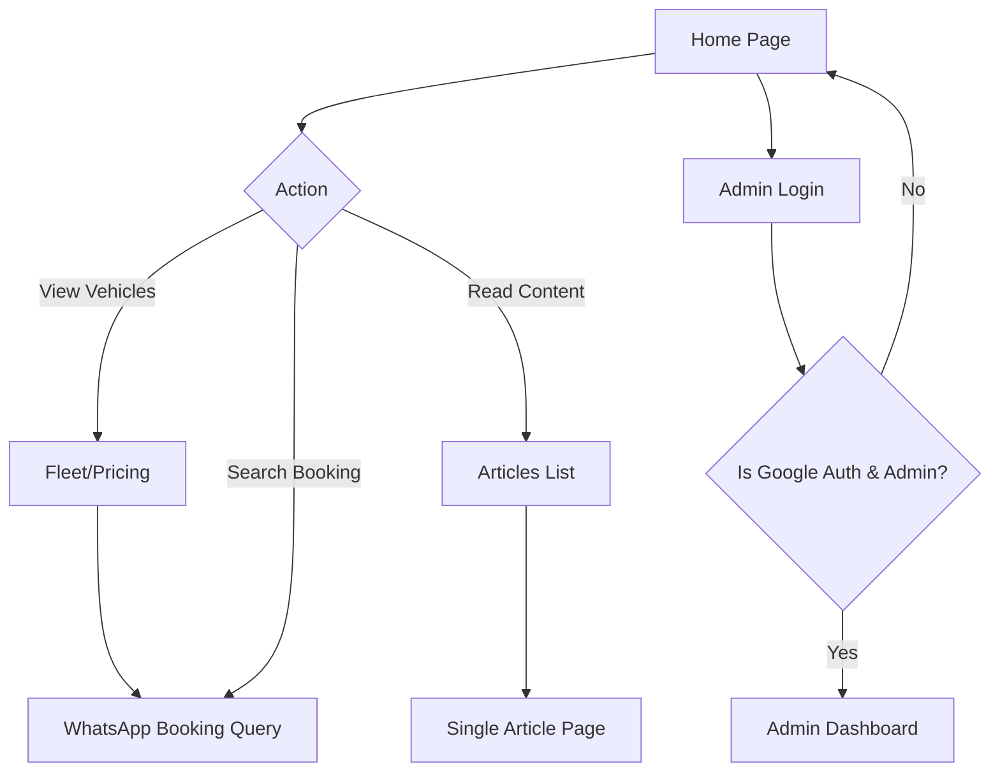

# User Flow Documentation

_Last updated: 2026-02-21T22:05:39+08:00_

## User Types

1.  **Public User (Customer):** Can browse fleet pricing, view SEO articles, and submit booking requests directly to WhatsApp.
2.  **Admin User:** Specifically approved users (by default, `hazman5001@gmail.com` as bootstrap) capable of logging in via Google Auth to access the CMS Dashboard.

## High-Level Navigation Flow

## Step-by-Step Flows

### 1. Booking Flow (Public)

1.  User lands on the Home Page and scrolls to the `BookingForm`.
2.  User inputs "From" (Pickup) and "To" (Dropoff) locations. The form auto-suggests locations using the OpenStreetMap Nominatim API.
3.  User selects Trip Type ("One Way" or "Return"), Date, and Time.
4.  User clicks **"Request Quote via WhatsApp"**.
5.  Data is parsed and formatted into a text message.
6.  The browser opens a new tab directed to `https://wa.me/` with the pre-filled booking details. _No data is saved to Firestore during this flow._

### 2. Authentication Flow (Admin)

1.  Admin navigates to `/admin/login`.
2.  Clicks "Sign in with Google".
3.  Firebase Auth opens a popup. Upon successful login, the `AuthContext` compares the user's UID to the `car-rental-users` collection.
4.  If the user exists and `isAdmin == true`, they are granted access. If this is the specific bootstrap email, an admin document is auto-created.
5.  Admin is redirected to `/admin/dashboard`.

### 3. CMS / Admin Flow

From the `/admin/dashboard`, the Admin can select 3 tabs:

1.  **Testimonials:** View all submitted testimonials. Can click "Approve/Unapprove" or "Delete".
2.  **Articles:** View all Markdown articles. Can click "Write Article", which opens the `ArticleEditor`. Inside the editor, the admin can draft content using AI prompt templates, upload images to storage, and save/publish the post to Firestore.
3.  **Users:** View a list of authenticated users. Can "Promote/Demote" admin rights or "Delete" accounts permanently.
