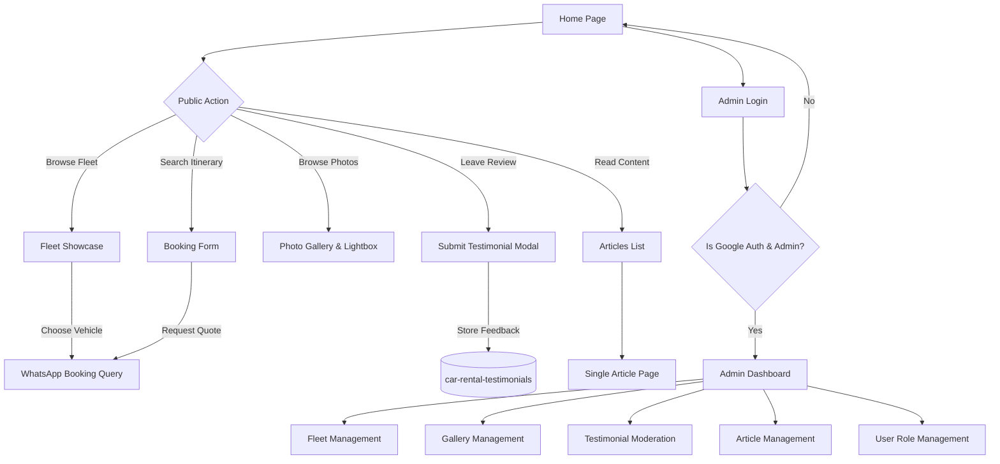

# User Flow Documentation

_Last updated: 2026-09-05T14:20:00+08:00_

## User Types

1. **Public User (Customer):** Can browse vehicle fleet pricing and specifications, view real trip/fleet photo galleries in an interactive lightbox, submit customer reviews/testimonials, read travel guides and SEO articles, and submit tailored booking inquiries directly to WhatsApp.
2. **Admin User:** Specifically approved users (authenticated via Firebase Google Auth with `isAdmin == true`) capable of accessing the CMS Dashboard to manage fleet cars, trip galleries, customer testimonials, SEO articles, and user permissions.

## High-Level Navigation Flow

```mermaid
flowchart TD
    A[Home Page] --> B{Public Action}
    B -->|Browse Fleet| C[Fleet Showcase]
    C -->|Choose Vehicle| D[WhatsApp Booking Query]
    B -->|Search Itinerary| E[Booking Form]
    E -->|Request Quote| D
    B -->|Browse Photos| F[Photo Gallery & Lightbox]
    B -->|Leave Review| G[Submit Testimonial Modal]
    G -->|Store Feedback| H[(car-rental-testimonials)]
    B -->|Read Content| I[Articles List]
    I --> J[Single Article Page]
    
    A --> K[Admin Login]
    K --> L{Is Google Auth & Admin?}
    L -->|No| A
    L -->|Yes| M[Admin Dashboard]
    M --> N[Fleet Management]
    M --> O[Gallery Management]
    M --> P[Testimonial Moderation]
    M --> Q[Article Management]
    M --> R[User Role Management]
```

## Step-by-Step Flows

### 1. Booking Flow (Public)

1. User lands on the Home Page and navigates to the `BookingForm`.
2. User selects the Booking Type: **"Transfer"** (Point A to Point B) or **"By the Hour"** (Chauffeur Service).
3. If **Transfer**: User inputs "From" (Pickup) and "To" (Dropoff) locations. The form auto-suggests locations using the OpenStreetMap Nominatim API.
4. If **By the Hour**: User inputs "Pickup Location" and selects the "Duration" (4, 8, or 12 hours).
5. User selects Vehicle Category (Sedan, Executive MPV, Luxury MPV, Van, Bus), Date, and Time.
6. User clicks **"Request Quote via WhatsApp"**.
7. Data is formatted into a structured itinerary message.
8. The browser opens a new tab directed to `https://wa.me/` with pre-filled booking details. _(Lead inquiries are routed straight to WhatsApp dispatch; no customer PII is permanently retained on Firestore during this step)_.

### 2. Fleet & Gallery Discovery Flow (Public)

1. **Fleet Exploration:**
   - User browses the `Fleet` section, filtering by vehicle categories (All, Sedans, MPVs, Vans & Buses).
   - Vehicles load dynamically from `car-rental-cars` (with fallback to default luxury fleet models).
   - User can swipe through interior/exterior photos per vehicle and review specs (capacity, luggage, transmission, fuel, daily/transfer rates).
   - Clicking "Book Now" opens WhatsApp with the specific vehicle pre-selected.
2. **Visual Gallery:**
   - User scrolls or clicks `#gallery` in the Navbar to view real fleet and customer trip photos.
   - Clicking any photo opens a full-screen interactive lightbox modal with keyboard navigation (Esc, Left/Right arrows) and image captions.

### 3. Customer Testimonial Flow (Public)

1. User scrolls to the `Testimonials` section on the Home Page.
2. User clicks **"Leave a Review"** to trigger the testimonial modal.
3. User fills in:
   - Name
   - Role / Origin (e.g. "Business Traveler from Singapore")
   - Star Rating (1 to 5 stars)
   - Review text
4. User clicks **"Submit Review"**.
5. The review is written to the `car-rental-testimonials` Firestore collection with `approved: false` and a `createdAt` timestamp.
6. A success confirmation is presented informing the customer that their feedback will be published after administrative moderation.

### 4. Authentication Flow (Admin)

1. Admin navigates to `/admin/login`.
2. Clicks "Sign in with Google".
3. Firebase Auth opens a popup. Upon successful login, `AuthContext` checks the user's UID against the `car-rental-users` collection.
4. If the user exists and `isAdmin == true`, they are granted access. If this is the specific bootstrap email (`hazman5001@gmail.com`), an admin profile is auto-created.
5. Unauthorized users are shown an access denied warning and signed out.
6. Authorized admins are redirected to `/admin/dashboard`.

### 5. CMS / Administrative Flows

From `/admin/dashboard`, administrators can manage 5 distinct operational modules:

#### A. Fleet Management (`CarEditor`)
- View all vehicles with real-time Firestore sync and quick action buttons.
- Click **"Add Vehicle"** (`/admin/cars/new`) or edit an existing car (`/admin/cars/:id`).
- Configure vehicle title, category, daily price, transfer price, seats, luggage, and feature tags.
- Upload main cover photo and multi-image galleries with real-time UI/UX feedback:
  - Files are validated client-side (<10MB, standard image MIME types).
  - Uploaded via `src/lib/storage.ts` to `storage.bijokdev.com` where WebP conversion and resizing happen server-side.
  - Interactive spinner, disabled action buttons, dynamic progress indicators (`Uploading X of Y...`), and pulsing skeleton placeholders inside the image grid.
- Save or delete vehicles (deleting removes associated uploaded images from storage).
- Admins can also run **"Import Fleet"** to seed default catalog vehicles into Firestore with one click.

#### B. Gallery Management
- Manage trip and fleet showcase photos stored in `car-rental-gallery`.
- Batch upload new photos via file picker:
  - Interactive spinner and progress bar track active uploads.
  - Newly uploaded photos render immediately in the grid.
- Edit photo captions inline (persisted to Firestore on blur).
- Delete photos with single-click removal, triggering cleanup on both Firestore and `storage.bijokdev.com`.

#### C. Testimonials Moderation
- Review customer testimonials submitted via the public website.
- Filter or sort reviews by pending vs approved status.
- Click **"Approve"** / **"Unapprove"** to toggle public visibility on the homepage.
- Permanently delete spam or obsolete reviews.

#### D. Article / Blog Management (`ArticleEditor`)
- Manage SEO travel guides and airport transfer advice stored in `car-rental-articles`.
- Click **"Write Article"** (`/admin/articles/new`) or edit existing posts (`/admin/articles/:id`).
- Write Markdown with live side-by-side rendering and HTML sanitization.
- Generate post outlines using Google Gemini AI prompt templates.
- Upload cover and inline markdown images directly to `storage.bijokdev.com`.
- Toggle draft vs published status.

#### E. User & Access Control
- View all registered accounts stored in `car-rental-users`.
- Inspect email addresses, Google profile photos, and `lastSignIn` timestamps.
- Promote or demote users between standard and `isAdmin` roles.
- Delete user accounts permanently.

